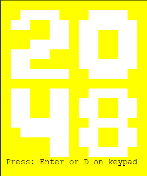

# 2048

## Table of Contents
   * [About](#About)
   * [Implementation](#Implementation)

About
============

Project Description: 
* Implementation of the game 2048 programmed with a combination of C and ARM assembly. The game is run on a Tiva C from Texas Instruments and the [EduBase-V2](https://trainer4edu.com/edubase_v2/ti_arm_tiva_msp432_launchpad.html)

Functionality:
* The game functions almost exactly like the app.  After each complete shift, a 'random' tile of 2 or 4 (2 being weighted heavier) is placed randomly in an open space.  The tiles can shift up, down, left or right.  The game will not produce a new tile if a shift does not occur - pressing left when all tiles are all the way to the left already.  The game is over when there are no longer any possible moves.

    
    
    
    
    

Implementation
============

Inputs:
* The game uses the UART for keyboard input as well as the built in keypad on the EduBase.  WASD keys on the keyboard for shifting functions and Enter to start the the game.

Outputs:
* The LCD is used to display the current time and the score.  The game is displayed in a terminal such as PuTTy via serial communication.

Code:
* LCD
    * The LCD code is a modified version of the code found [here](http://www.microdigitaled.com/EduPad/Tiva-EduPad/05_LCD_parallel.txt).  It was adjusted to work without the required header file.  Some additional elements were added such as a function to move the cursor and print a string.

* Keypad
    * The keypad has a scanning routine that is run every 1ms via a timer interrupt.  The interrupt cycles which column output is active.  A interrupt is triggered when a key is pressed on the keypad.  It is determined which key was pressed by checking which column is active and by looking at what row was pressed.
    To reduce multiple presses to occur in a very short period of time a 250ms delay is placed between each press.

* Shifting
    * In order to perform the necessary shifting operations, a series of functions were made.  If the tiles need to shift down, the first column is copied into a temporary array.  When a non zero number is found it is placed in the right most non zero index.  If 2 adjacent numbers are the same they are merged and the score is increased.  A merge can only happen once (if the column appears as [0, 2, 2, 4] the result will appear as [0, 0, 4, 4] because the two 4s will not double merge).  The column is then replaced back into the board and the score in incremented.

* Game Over
    * In order to check for game over, the board is looped to determine if:
        1. There are any empty spaces.
        2. A merge can occur.

        If neither of these conditions are true the game is over.

